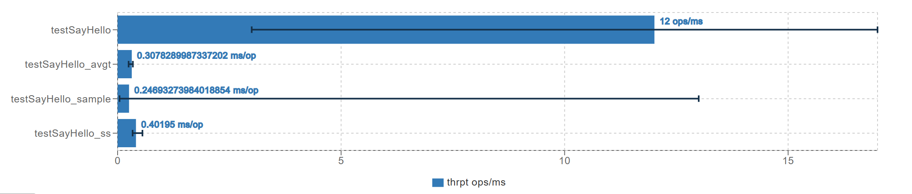
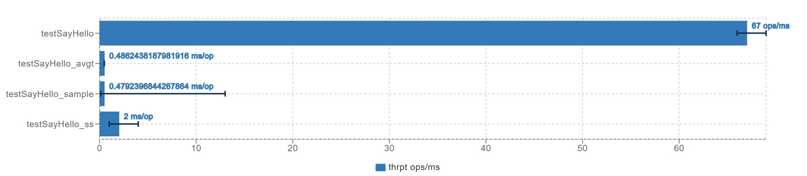

# xianger-rpc

## 介绍

xianger-rpc 是一个rpc框架，是对rpc的学习和实践。

目前参考了：

- guide-rpc：https://github.com/Snailclimb/guide-rpc-framework
- wxy-rpc：https://github.com/viego1999/wxy-rpc
- dubbo：https://github.com/apache/dubbo

目前已经实现：

- 注册中心：
  - 基于zookeeper的服务注册和发现中心，使用curator完成。
  
- 网络传输：
  - 基于socket（仅jdk序列化），netty的通信方式
  
- 序列化算法：
  - jdk，json，hessian、kryo、protostuff

- 动态代理：

  - 扫描注解，进行代理对象生成，屏蔽调用细节
  - 两种代理方式：jdk，cglib

- 负载均衡

  - 随机（可带权重）
  - 轮询（可带权重）
  - 一致性hash（带权重方案未实现）

- 传输协议

  - 消息头（16字节）设计为：

    ```
    *   -------------------------------------------------------------------------------------
    *  | 魔数 (4byte) | 版本号 (1byte) | 消息类型 (1byte) | 序列化算法 (1byte) | 压缩算法 (1byte) |
    *   -------------------------------------------------------------------------------------
    *  |           请求ID (4byte)                  |             消息长度 (4byte)             |
    *   -------------------------------------------------------------------------------------
    ```

- 其它
    - example中简单的测试用例
    
    - gzip压缩算法实现
    
    - 消息重试实现
    
    - 服务保护：简易的限流器和熔断器，并支持服务降级
    
    - 心跳机制保持长连接
    
    - 单例工厂（将clazz作为锁）
    
    - 通过yaml配置文件进行bean的自动配置

      
    
- JMH 性能测试
    - 单线程测试：TPS约12000
    
      
    
    - 32个线程测试：TPS约67000
    
      